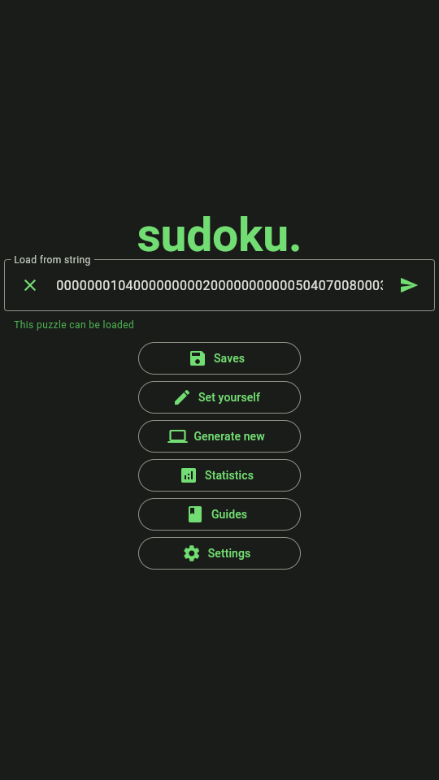
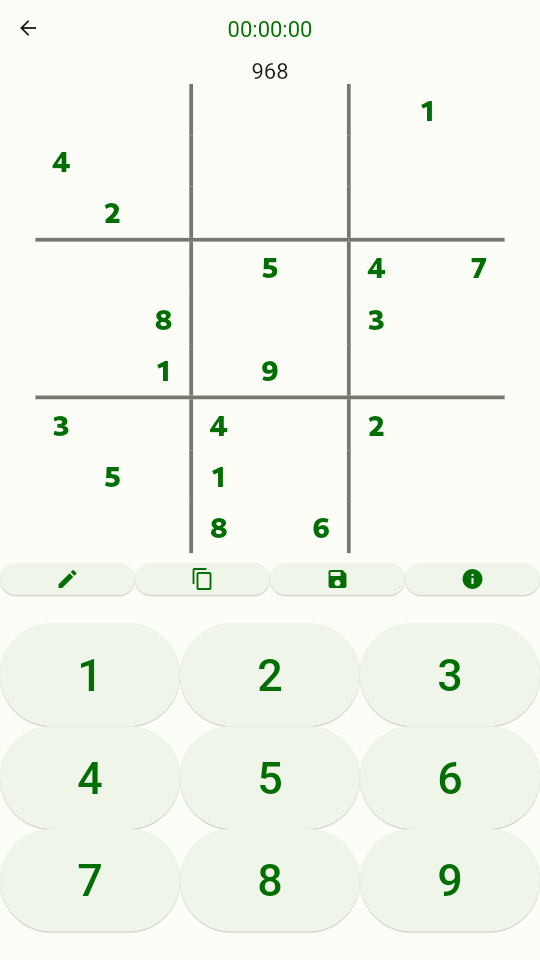
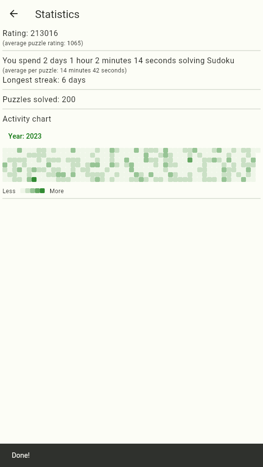

# 🔢 sudoku.

Sudoku app written in Flutter (for now 📱 **Android-only**).

<!--toc:start-->
- [🔢 sudoku.](#🔢-sudoku)
  - [👀 Features](#👀-features)
  - [📆 Plans](#📆-plans)
      - [Before v1.0](#before-v10)
      - [After](#after)
      - [Very after](#very-after)
  - [🏗️ How to build](#🏗️-how-to-build)
  - [🫵 How you can help](#🫵-how-you-can-help)
  - [💪 Powered by](#💪-powered-by)
<!--toc:end-->

| Home | Solving | Statistics |
| ---- | ------- | ---------- |
|  |  |  |

## 👀 Features

* 🎨 Material 3 theme and minimalistic design
* 🎁 Free and Open-Source
* 🚫 No Adds
* 💻 Generate Sudoku 
* 📥 Import Sudoku
* 💾 Save Sudoku
* ⛔ Error checking
* 📚 Guides (WIP)
* 📈 Solving statistics (WIP)
* 🌐 Translatable (WIP)

 **WIP** - work in progress 

## 📆 Plans

This is a preferable timeline for tasks. But some tasks might be done faster or slower than listed here.

#### Before v1.0

* Improve statistics. Add diagrams, GitHub-style activity chart (done)
* Add more guides (for now: skip)
* Transform UI (done). Create separated pages for almost every button on main screen (for now: skip)
* Add backwards-compatibility for statistics and saves (done using [Hive](https://pub.dev/packages/hive))

#### After

* Add other types of Sudoku
* Add MORE animations (never enough...)
* Write documentation (for developers)
* Add hints (fairly simple, everything is already in Sudoku crate, just need to connect it to the UI part)
* Publish somewhere
* Translate guides
* Automate app screenshots

#### Very after

* Cross-platform support (Windows, Linux, Android. Maybe Mac and iPhone)
* Widget for Android with Sudoku of The Day

## 🏗️ How to build

1. Install Rust and Flutter
2. Install Android SDK
3. Run `flutter build apk` (optionally add `--split-per-abi` to split APKs for different architectures)

## 🫵 How you can help

For now, I did not create a proper guide for all things below. You will probably need to wait before help 😅. But, if you think you can do it without guides, here is what you can do:

* Share your Ideas in `Issues` tab on GitHub
* Find bugs. Report them in `Issues` tab on GitHub
* Write tests
* Correct typos
* Improve code quality
* Close some task from [plans](#📆-plans) section
* Translate app. Multiple languages support is done with i18n library. Files for translation are in `lib/i18n`
* Suggest design for the app in general
* Suggest an icon (preferably with material design support)

If you don't understand something - please feel free to open an issue!

## 💪 Powered by

* 🎨 [Flutter](https://flutter.dev) (see additional dependencies in `pubspec.yaml`)
* 💻 [Rust Sudoku crate](https://crates.io/crates/sudoku) (for generating and rating Sudoku)
* 🐝 [Hive database](https://pub.dev/packages/hive) (for storing settings and statistics)
* 📷 [Integration test](https://docs.flutter.dev/cookbook/testing/integration/introduction) (for automated screenshots with golden testing)
* 🌉 [Flutter-Rust bridge](https://pub.dev/packages/flutter_rust_bridge)
